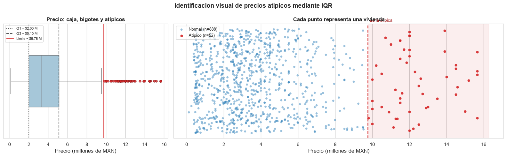
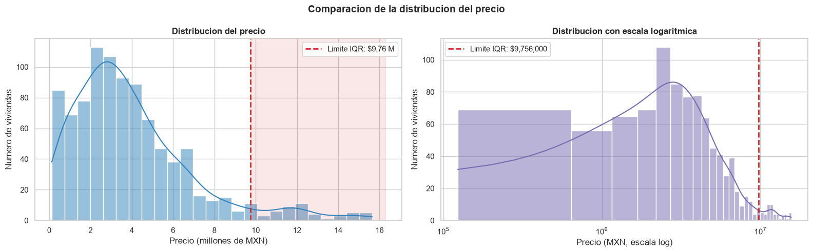
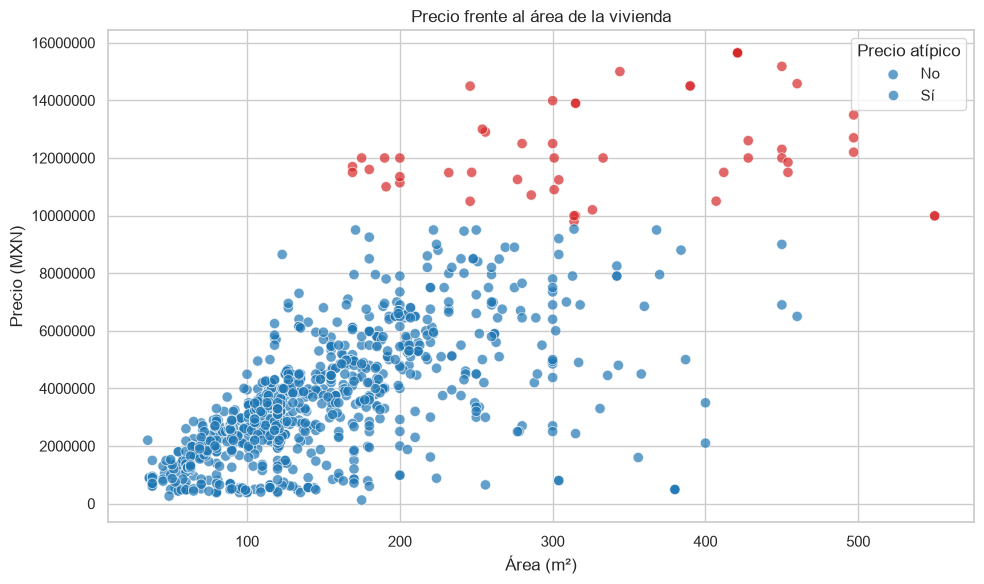
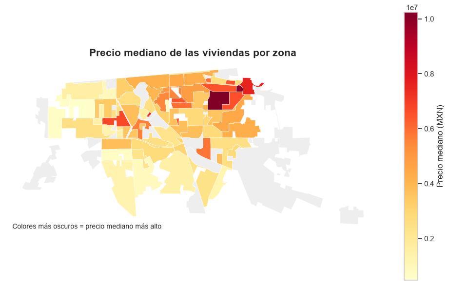
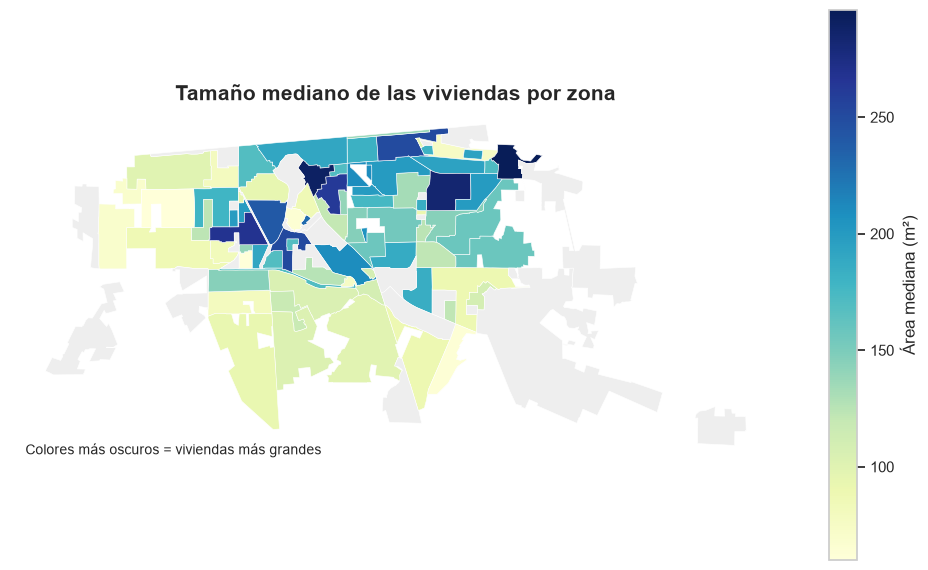
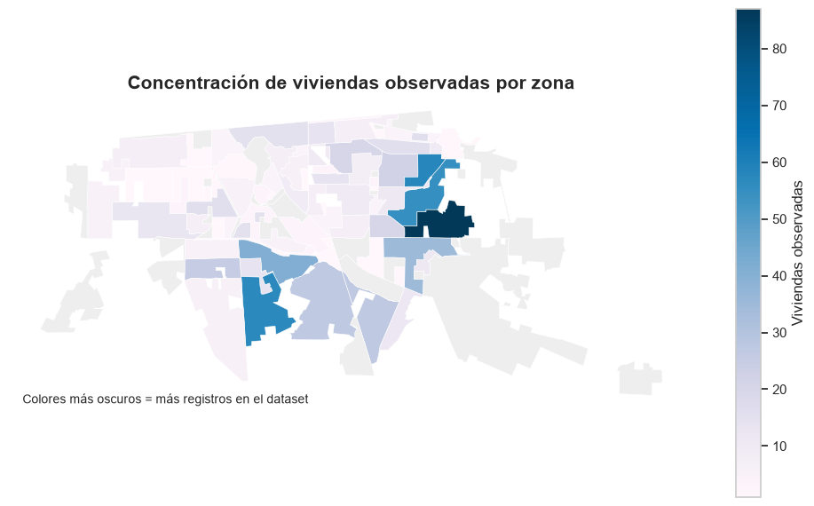

# Análisis de valores atípicos en precios de viviendas

Análisis exploratorio de un conjunto de datos inmobiliarios de Mexicali. El proyecto identifica valores atípicos, los visualiza y propone transformaciones para preparar los datos para análisis estadístico o modelos predictivos.

## Objetivo

Responder de forma reproducible las siguientes preguntas:

1. ¿Existen datos atípicos? ¿En qué variables?
2. ¿Qué decisión tomar con esos registros?
3. ¿Qué transformación conviene aplicar?

## Resultados principales

El dataset contiene **940 viviendas y 7 variables**, sin valores faltantes.

| Variable | Resultado con IQR |
|---|---:|
| `precio(mxn_peso)` | 52 valores atípicos (5.53%), superiores a $9,756,000 |
| `area(m2)` | 42 valores atípicos (4.47%), superiores a 334 m² |
| `baños` | 34 valores atípicos (3.62%), correspondientes a viviendas con 4 baños |
| `habitaciones` | Variable discreta; el IQR no es concluyente porque Q1 = Q3 = 3 |

Los valores atípicos de precio y área no se eliminan automáticamente: pueden representar viviendas reales de mayor tamaño o de lujo. El notebook conserva todos los registros y crea la variable `precio_atipico` para analizarlos por separado.

## Visualizaciones

El notebook genera:

- Boxplot del precio con cuartiles, límite superior del IQR y atípicos.
- Strip plot donde cada punto representa una vivienda.
- Histogramas del precio en escala normal y logarítmica.
- Gráfica de dispersión entre precio y área.
- Mapa coroplético independiente del precio mediano por zona.
- Mapa coroplético independiente del área mediana para localizar las viviendas más grandes.
- Mapa coroplético independiente de la cantidad de viviendas observadas por zona.
- Tabla con las viviendas de precio más alto.

Los precios se muestran en millones de pesos en las gráficas para mejorar su legibilidad.

## Galería de resultados

Las siguientes imágenes se generan directamente a partir de `main.ipynb` y se incluyen para facilitar la revisión del proyecto en GitHub.

### Precios atípicos

El análisis utiliza los **940 registros**, incluidos los 52 precios identificados como atípicos. Los valores atípicos se resaltan en rojo, pero no se eliminan.







### Mapas de Mexicali

Los mapas utilizan la geometría de `mxl.shp`. Las zonas sin registros aparecen en gris.

#### Precio mediano por zona



#### Tamaño mediano de las viviendas



#### Concentración de viviendas observadas



## Mapas territoriales

El proyecto utiliza `mxl.shp` como geometría principal para los mapas de Mexicali. El archivo fue proporcionado para el proyecto y contiene 97 polígonos, pero no incluye atributos de código postal. Por ello, el notebook usa `data/baja_california_postal.geojson` únicamente como capa auxiliar para transferir espacialmente los datos resumidos por código postal hacia los polígonos de `mxl.shp`. La fuente de la capa auxiliar es [open-mexico/mexico-geojson](https://github.com/open-mexico/mexico-geojson).

El archivo `mxl.shx` es el índice espacial reconstruido automáticamente a partir del SHP. El notebook también puede regenerarlo si no existe. Debido a que el SHP no trae una tabla `.dbf`, el mapa trabaja con la geometría y no muestra nombres de zonas.

- El mapa de precios usa el **precio mediano** transferido a las zonas de `mxl.shp`, una medida robusta frente a valores atípicos.
- El mapa de concentración usa la cantidad de viviendas/anuncios presentes en `houses.csv`.
- Solo se colorean las zonas a las que se pudo asignar espacialmente un código postal con datos; las restantes aparecen como “Sin registros”.

Este dataset no incluye población censal; por eso el segundo mapa no afirma dónde vive más gente, sino dónde hay más viviendas observadas en la muestra. Para medir habitantes sería necesario incorporar una fuente censal adicional.

## Transformaciones

Se conservan las variables originales y se crean:

```python
df["precio_atipico"] = ...
df["precio_log"] = np.log1p(df["precio(mxn_peso)"])
df["area_log"] = np.log1p(df["area(m2)"])
```

La transformación logarítmica reduce la asimetría y la influencia de los precios más altos. No sustituye la variable original.

## Actividad adicional: Market Basket Analysis

La actividad de reglas de asociación se encuentra separada en [market_basket/](market_basket/), para no mezclarla con el análisis de valores atípicos.

El notebook [market_basket_apriori.ipynb](market_basket/market_basket_apriori.ipynb):

- Convierte cada vivienda en una transacción de atributos.
- Categoriza precio, área, habitaciones y baños.
- Aplica el algoritmo Apriori.
- Calcula soporte, confianza y lift.
- Filtra y grafica reglas relacionadas con precio y área.

Con los umbrales actuales, la asociación más destacada es:

```text
precio_alto → area_grande
soporte ≈ 0.246 | confianza ≈ 0.745 | lift ≈ 2.238
```

Esto significa que aproximadamente el 74.5% de las viviendas clasificadas como de precio alto también están clasificadas como de área grande. El lift mayor que 1 indica una asociación positiva respecto a la frecuencia general de `area_grande`. No implica causalidad y, dado que `houses.csv` no registra compras, debe interpretarse como co-ocurrencia de características inmobiliarias.

El notebook incluye además un mapa de calor donde cada fila representa el 100% de una categoría de precio y se divide entre áreas pequeñas, medianas y grandes. Esta visualización facilita comparar directamente la asociación entre tamaño y precio.

## Estructura del proyecto

```text
.
├── data/
│   ├── houses.csv
│   └── baja_california_postal.geojson
├── figures/
│   ├── precio-atipicos.png
│   ├── distribucion-precio.png
│   ├── precio-vs-area.png
│   ├── mapa-1.png
│   ├── mapa-2.png
│   └── mapa-3.png
├── mxl.shp
├── mxl.shx
├── main.ipynb
├── market_basket/
│   ├── market_basket_apriori.ipynb
│   └── README.md
├── requirements.txt
├── .gitignore
└── README.md
```

## Instalación y ejecución

Se recomienda Python 3.10 o superior.

### Windows PowerShell

```powershell
python -m venv .venv
.venv\Scripts\Activate.ps1
python -m pip install -r requirements.txt
jupyter notebook main.ipynb
```

También se puede abrir el proyecto en VS Code y seleccionar el intérprete de `.venv` como kernel del notebook.

## Método estadístico

Para cada variable numérica se calcula:

```text
IQR = Q3 - Q1
Límite inferior = Q1 - 1.5 × IQR
Límite superior = Q3 + 1.5 × IQR
```

Los registros que quedan fuera de esos límites se marcan como posibles atípicos. La decisión final debe considerar el contexto del negocio: un precio alto no es necesariamente un error.

## Nota sobre las variables

- `precio(mxn_peso)` y `area(m2)` se analizan como variables numéricas continuas.
- `habitaciones` y `baños` son variables discretas.
- `codigo_postal` se interpreta como categoría geográfica, no como una magnitud numérica.
- `tipo` y `localidad` son variables categóricas.

## Reproducibilidad

El notebook fija la semilla utilizada para el desplazamiento visual de los puntos (`seed = 42`) y calcula todos los límites directamente a partir de `data/houses.csv`. Esto permite volver a ejecutar el análisis y obtener resultados consistentes.
